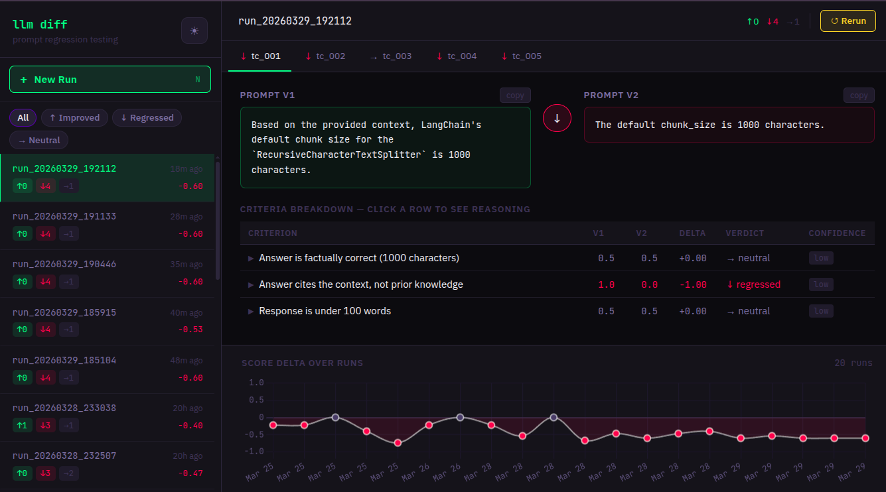

# LLM Diff

> Prompt regression testing for RAG pipelines. Like git diff, but for AI.

[](https://pypi.org/project/llmdiff)
[](LICENSE)
[](https://docs.litellm.ai)

<br/>



<br/>

## Why LLM Diff

- **You changed a prompt. Did it get better?** Find out in 2 minutes.
- **Works with any LLM** — Groq (free), OpenAI, Anthropic, Ollama, Google Gemini.
- **Local-first.** No accounts, no cloud, no data leaves your machine.
- **One env var.** Set `GROQ_API_KEY` and you're done.

## Quickstart

```bash
# 1. Install
pip install llmdiff

# 2. Get a free Groq API key at console.groq.com (takes 90 seconds)

# 3. Set the key
export GROQ_API_KEY=your_key_here

# 4. Copy an example test file
cp examples/rag_pipeline.yaml my_tests.yaml

# 5. Compare your prompts
llmdiff compare my_tests.yaml

# 6. Open the web dashboard
llmdiff serve
# → http://localhost:7331
```

## I have a LangChain RAG app — how do I use this?

If your app looks like:

```python
result = chain.invoke({"question": q, "context": c})
```

Translate it into a YAML test case:

```yaml
model: groq/llama3-70b-8192
judge_model: groq/llama3-70b-8192
test_cases:
  - id: my_test
    input: "What is the default chunk size?"
    context: "LangChain's default chunk_size is 1000 characters..."
    criteria:
      - "Answer is factually correct"
      - "Response is concise (under 50 words)"
    prompt_v1: |
      You are a helpful assistant. Context: {context}
      Question: {input}
    prompt_v2: |
      Answer only from context. Be concise.
      Context: {context}
      Question: {input}
```

Then run: `llmdiff compare my_tests.yaml`

## Switching providers

Change 1–2 lines in your YAML — no code changes:

| Provider       | Model string                          | Env var             |
|----------------|---------------------------------------|---------------------|
| Groq (default) | `groq/llama3-70b-8192`                | `GROQ_API_KEY`      |
| Groq fast      | `groq/llama-3.1-8b-instant`           | `GROQ_API_KEY`      |
| OpenAI         | `openai/gpt-4o-mini`                  | `OPENAI_API_KEY`    |
| Anthropic      | `anthropic/claude-3-haiku-20240307`   | `ANTHROPIC_API_KEY` |
| Google Gemini  | `gemini/gemini-2.0-flash`             | `GOOGLE_API_KEY`    |
| Ollama (local) | `ollama/llama3`                       | (none)              |

> **Reduce judge bias:** use a different model family for `judge_model` than `model`.
> Example: Gemini runner + Groq/Llama judge = cross-family, lowest self-preference bias.
> See `examples/rag_pipeline_groq_judge.yaml` for a ready-made cross-family config.

## YAML reference

```yaml
model: groq/llama3-70b-8192        # model for generating outputs
judge_model: groq/llama3-70b-8192  # model for judging (can be a different provider)

test_cases:
  - id: tc_001                      # unique identifier
    input: "user question here"
    context: "RAG context passage"  # optional
    criteria:
      - "Answer is factually correct"
      - "Response is under 100 words"
    prompt_v1: |
      Your baseline prompt. Use {input} and {context} placeholders.
    prompt_v2: |
      Your new prompt. Same placeholders.
```

## CLI reference

| Command | Description |
|---------|-------------|
| `llmdiff compare <yaml>` | Run + print colored diff to terminal |
| `llmdiff run <yaml>` | Run + store results (no terminal output) |
| `llmdiff history` | List past runs |
| `llmdiff serve` | Start web dashboard at localhost:7331 |
| `llmdiff demo` | Try it without an API key |

## Web dashboard

```bash
llmdiff serve
```

Opens at `http://localhost:7331`. Features:

- Side-by-side output comparison per test case
- Live streaming — results appear as they complete
- Run history with score trend chart
- Click any past run while a new test is running — views are independent

## Environment variables

| Variable | Default | Description |
|----------|---------|-------------|
| `GROQ_API_KEY` | — | Groq API key (default provider) |
| `OPENAI_API_KEY` | — | OpenAI API key |
| `ANTHROPIC_API_KEY` | — | Anthropic API key |
| `GOOGLE_API_KEY` | — | Google Gemini API key |
| `LLMDIFF_DB_PATH` | `~/.llmdiff/history.db` | SQLite database path |
| `LLMDIFF_PORT` | `7331` | Web server port |
| `LLMDIFF_HOST` | `127.0.0.1` | Web server bind address |
| `LLMDIFF_YAML_DIR` | `~/.llmdiff/tests` | Allowed directory for YAML test files |

## Docker

```bash
docker-compose up
# Dashboard at http://localhost:7331
```

Mount your YAML test files into the container:

```yaml
# docker-compose.yml — add a volume:
volumes:
  - ./my_tests:/workspace/tests
```

## Contributing

1. Fork the repo
2. Create a branch: `git checkout -b feat/my-feature`
3. Run tests: `pytest tests/ -v`
4. Open a PR
